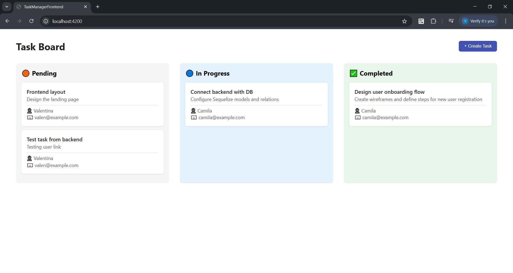
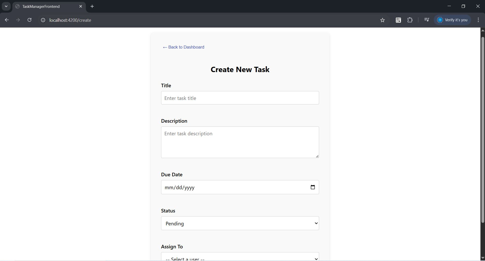

# 🗂️ Task Manager 

Full Stack Task Management Application developed using **Angular** on the frontend and **Node.js + Express + MySQL** on the backend. It allows users to create, list and update, as well as manage the assigned users.

---

### 🖼️ Preview





### ✨ Watch how it works


---

## 📌 Table of Contents

- [Technologies](#-technologies)
- [Project Structure](#-project-structure)
- [Local Setup Instructions](#-local-setup-instructions)
- [REST API](#-rest-api)
- [Error Handling](#-error-handling)
- [App Features](#-app-features)
- [Architecture Diagram](#-architecture-diagram)
- [Resources Used](#-resources-used)
- [Postman/Swagger Collection](#-postmanswagger-collection)

---

## 🚀 Technologies

### Frontend
- Angular (standalone API)
- Angular Router
- SCSS

### Backend
- Node.js
- Express.js
- Sequelize ORM
- MySQL
- Dotenv

---

## 🧱 Project Structure

```
task-manager/
├── task-manager-backend/
│   ├── src/
│   │   ├── config/
│   │   │   └── config.js          # Sequelize DB connection setup
│   │   ├── controllers/
│   │   │   ├── taskController.js  # Business logic for task operations
│   │   │   └── userController.js  # Business logic for user operations
│   │   ├── models/
│   │   │   ├── task.js            # Task model definition
│   │   │   └── user.js            # User model definition
│   │   ├── routes/
│   │   │   ├── taskRoutes.js      # Routes for task-related endpoints
│   │   │   └── userRoutes.js      # Routes for user-related endpoints
│   │   └── index.js               # Backend entry point
│   ├── app.js                     # Express app configuration
│   ├── .env                       # Environment variables
│   └── package.json               # Project dependencies and scripts
├── task-manager-frontend/
│   ├── src/app/
│   │   ├── dashboard/             # Dashboard component (kanban view)
│   │   ├── pages/task-form/       # Task creation form component
│   │   ├── services/              # HTTP services to connect with backend
│   │   ├── app.routes.ts          # Frontend routing configuration
│   │   └── app.config.ts          # Application-level settings
│   ├── index.html                 # Main HTML file
│   └── main.ts                    # Angular bootstrap file
└── README.md                      # Project documentation
```

---

## 🛠️ Local Setup Instructions

### 🔧 Prerequisites
- Node.js and npm
- MySQL
- Angular CLI (`npm install -g @angular/cli`)

### 📦 Backend
```bash
cd task-manager-backend
cp .env.example .env
npm install
npm run dev
```

### 💻 Frontend
```bash
cd task-manager-frontend
npm install
ng serve --open
```
---

## 🔗 REST API

### Users (`/api/users`)
| Method | Endpoint         | Description                        |
|--------|------------------|------------------------------------|
| GET    | `/`              | Get all users                      |
| POST   | `/`              | Create a new user                  |
| GET    | `/:id/tasks`     | Get all tasks assigned to a user  |

### Tasks (`/api/tasks`)
| Method | Endpoint         | Description                        |
|--------|------------------|------------------------------------|
| GET    | `/`              | Get all tasks                      |
| POST   | `/`              | Create a new task                  |
| PUT    | `/:id`           | Update a task                      |
| DELETE | `/:id`           | Delete a task                      |

---

## ⚠️ Error Handling

- `400 Bad Request` if `title`, `dueDate`, or `userId` is missing when creating a task.
- `400 Invalid email format` if email is invalid.
- `404 Task/User not found` if the resource does not exist.
- `500 Internal Server Error` for general failures.

---

## 🧩 App Features

### 🖥️ Frontend (Angular standalone)

- **📋 Kanban-style dashboard** with three columns:
  - 🔶 **Pending**
  - 🔵 **In Progress**
  - ✅ **Completed**
- **📝 Task creation form** with validations
- **📤 Sends data to backend** via service
- **🔁 Navigation** between dashboard and form

---

## 📊 Architecture Diagram

```
[Frontend - Angular] <--> [API - Express.js] <--> [Database - MySQL]
       |                          |                          |
TaskFormComponent       userRoutes/taskRoutes         Sequelize Models
DashboardComponent   userController/taskController     User / Task
```

---

## 📚 Resources Used

- [Angular Standalone Components](https://angular.io/guide/standalone-components)
- [Angular Routing](https://angular.io/guide/router)
- [Express.js](https://expressjs.com/)
- [Sequelize ORM Documentation](https://sequelize.org/)
- [MySQL Reference Manual](https://dev.mysql.com/doc/)
- [Postman - Create Collections](https://learning.postman.com/docs/getting-started/creating-the-first-collection/)

---

## 📬 Postman/Swagger Collection

A Postman collection is provided (see `/postman` folder or request export) with both success and error test cases, including:

- Create task with missing required fields (should fail)
- Create user with invalid email format (should fail)
- Get tasks by user (valid and invalid cases)


